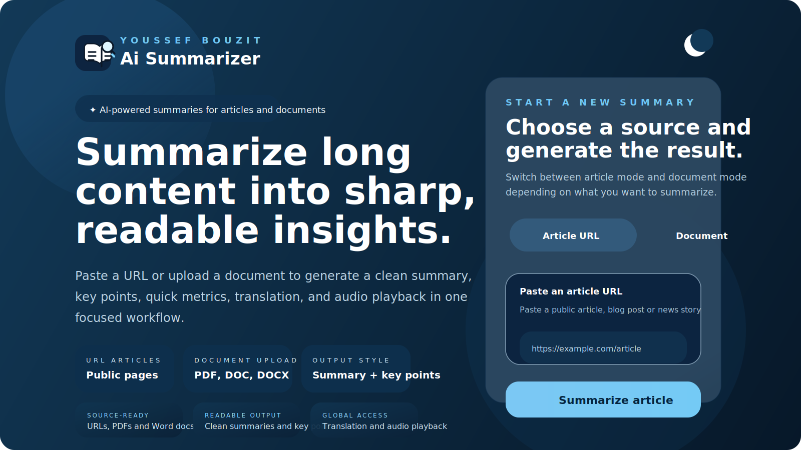

# Ai Summarizer

<p align="center">
  
</p>

<p align="center">
  <strong>AI-powered summarization for articles, PDFs, and Word documents.</strong>
</p>

<p align="center">
  Ai Summarizer turns long-form content into clean summaries, key points, quick metrics, translation output, and audio-ready text in one focused workflow.
</p>

<p align="center">
  
  
  
  
  
  
</p>

## Overview

Ai Summarizer is a full-stack web application designed to simplify content digestion. It supports both public article URLs and uploaded documents, then produces a structured output that is easier to read, translate, and reuse.

The experience is built around a simple flow:
1. choose a source
2. generate a summary
3. review the key points and metrics
4. translate or listen to the result

When a valid `GEMINI_API_KEY` is available, the app uses Gemini for higher-quality summarization. If Gemini is unavailable, the backend falls back to a local summarization strategy so the product remains usable.

## Core Features

| Capability | Details |
|---|---|
| URL summarization | Summarizes public article pages and blog posts |
| Document upload | Supports `PDF`, `DOC`, and `DOCX` files |
| Structured output | Returns a summary, key points, and compression metrics |
| Translation | Lets users translate the generated summary |
| Audio playback | Supports text-to-speech directly in the interface |
| Content extraction | Uses `Readability` and `jsdom` to improve article parsing |
| Deployment-ready | Configured for local production builds and Vercel deployment |

## Tech Stack

- React
- TypeScript
- Vite
- Express
- TanStack Query
- Tailwind CSS
- Gemini API
- Vercel serverless API handlers

## Local Development

### 1. Install dependencies

```bash
npm install
```

### 2. Create the environment file

```bash
cp .env.example .env
```

Update `.env` with your values:

```env
GEMINI_API_KEY=your_real_gemini_api_key
NODE_ENV=development
PORT=5001
GEMINI_MODEL=gemini-1.5-flash
MAX_CONTENT_LENGTH=30000
```

### 3. Start the development server

```bash
npm run dev
```

Open:

```text
http://127.0.0.1:5001
```

## Production Build

Run the checks and production build:

```bash
npm run check
npm run build
```

Start the built server locally:

```bash
npm start
```

## Environment Variables

| Variable | Required | Description |
|---|---:|---|
| `GEMINI_API_KEY` | Yes | Gemini API key from Google AI Studio |
| `GEMINI_MODEL` | No | Gemini model name, default: `gemini-1.5-flash` |
| `MAX_CONTENT_LENGTH` | No | Maximum content length sent to Gemini |
| `PORT` | No | Local server port |
| `NODE_ENV` | No | Runtime mode |

## Project Structure

```text
api/
  summarize.ts
  translate.ts
  services/
    gemini.ts
    summarizer/
      index.ts
      source.ts
      summary.ts
      text.ts
      types.ts

client/
  src/
    pages/
      home.tsx

server/
  index.ts
  routes-new.ts

shared/
  schema.ts
```

## Deploy on Vercel

This project is already configured for Vercel.

### Option 1. Import from GitHub

1. Push the project to your GitHub repository.
2. Import the repository into Vercel.
3. Use these project settings if Vercel asks:

```text
Build Command: npm run build
Output Directory: dist/public
Install Command: npm install
```

4. Add these environment variables in the Vercel dashboard:

```text
GEMINI_API_KEY
GEMINI_MODEL
MAX_CONTENT_LENGTH
```

### Option 2. Vercel CLI

```bash
npm i -g vercel
vercel
```

Then add the same environment variables in Vercel.

## Notes

- Do not push `.env` to GitHub.
- Some websites may restrict scraping or return partial content.
- If `GEMINI_API_KEY` is invalid, the app falls back to a local summarizer.

## Author

**Youssef Bouzit**

- GitHub: https://github.com/YOUSSEF-BT
- LinkedIn: https://www.linkedin.com/in/youssef-bouzit-74863239b/
- Email: bt.youssef.369@gmail.com

## License

MIT
